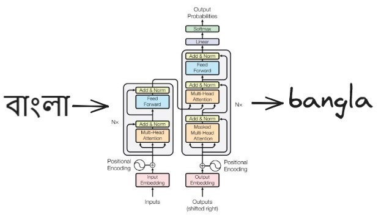

# translit-former
<!-- markdownlint-disable MD033 MD045 -->
<p align="center">
  
</p>

`translit-former` is a transformer-based transliteration model. Works pretty well when trained on the Bengali subset of the [Dakshina dataset](https://github.com/google-research-datasets/dakshina). Recently wrote a blog-post on this which you can read [here](https://souvikshanku.github.io/blog/translit-former/).

## Example Usage

To train the model from scratch, do:

```bash
# clone the repo in your local
git clone https://github.com/souvikshanku/translit-former.git
cd translit-former

# create virtual environment and install dependencies
python -m venv .venv
source .venv/bin/activate
pip install -r requirements.txt

# train the model
python train.py
```

Training takes a lot of time on CPU, so using a GPU is recommended. Once training is complete, navigate to [evals.ipynb](https://github.com/souvikshanku/translit-former/blob/main/eval.ipynb) for evaluation and example usage.
